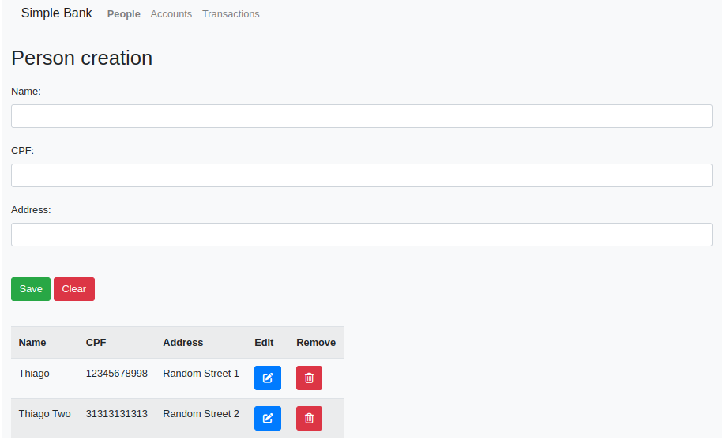
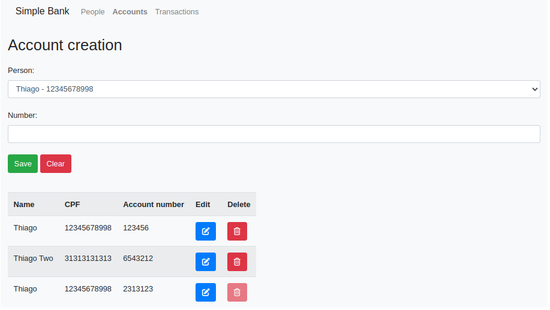
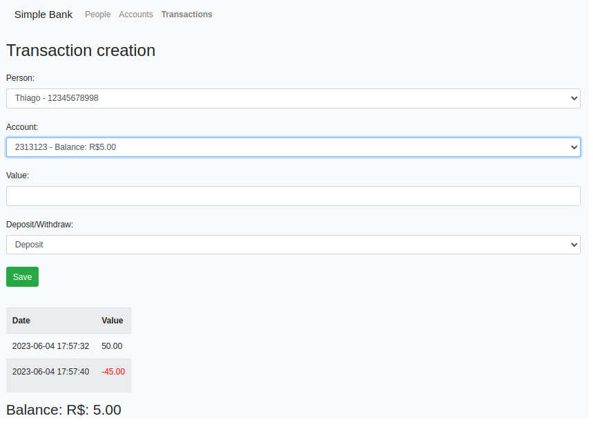

# simple-bank
Just a simple Laravel CRUD that simulates some bank operations

## Steps to run it:
- Enter the application directory
- Create a .env file in the directory app and adjust it based on the app/.env.example
- Run ```docker-compose up```
- The application will be running on localhost:8080


**Person creation page**



**Account creation page**



**Transaction creation page**


